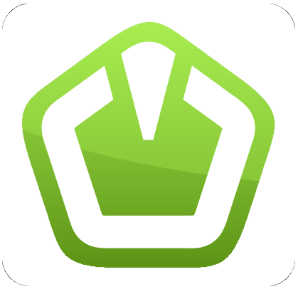
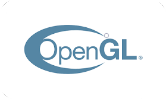

<h1 aligh="center">I'm a game developer (kinda ^_^)</h1>
<h1 aligh="center">You will find lots of interesting projects about games. Recently I've started learning C++ and there'll be everything in this language</h1>
<h1 aligh="left">Enjoy!)</h1>

---
<h1 align="left">I'm learning...</h1>

&nbsp&nbsp&nbsp

<h1 align="left">What I plan to learn</h1>

<!--
**ArhanCrane/ArhanCrane** is a ✨ _special_ ✨ repository because its `README.md` (this file) appears on your GitHub profile.

Here are some ideas to get you started:

- 🔭 I’m currently working on ...
- 🌱 I’m currently learning ...
- 👯 I’m looking to collaborate on ...
- 🤔 I’m looking for help with ...
- 💬 Ask me about ...
- 📫 How to reach me: ...
- 😄 Pronouns: ...
- ⚡ Fun fact: ...
-->
